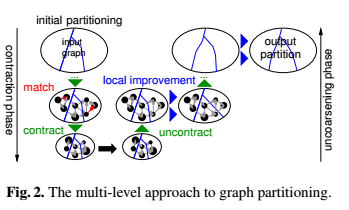
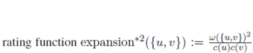
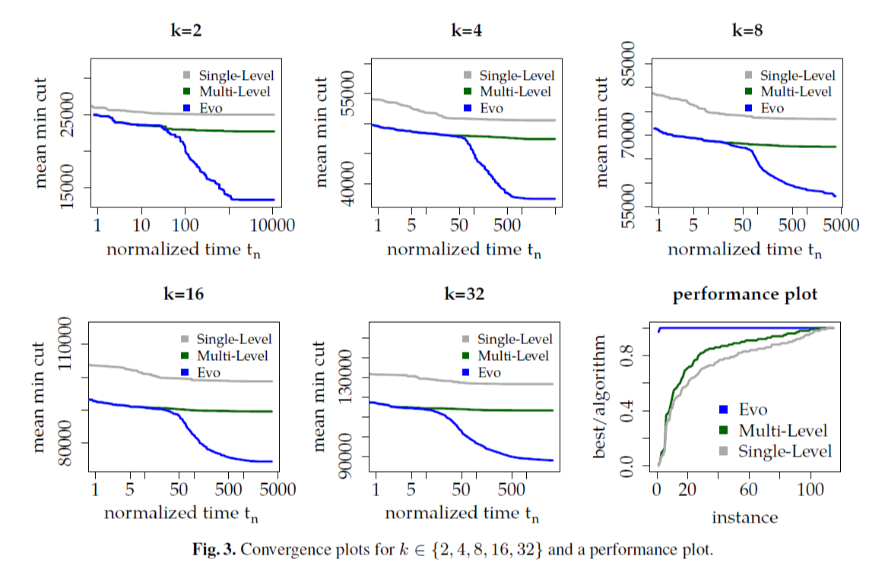
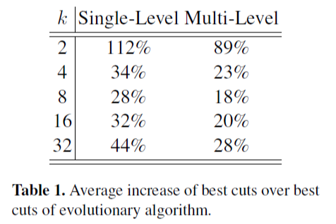

# Evolutionary Acyclic Graph Partition

## Abstract

DAG被广泛用于流应用中来模拟数据流和执行依赖性。这使得图划分算法能够用于多处理器体系结构的并行计算问题。但是，由于资源限制，在将流式应用程序映射到嵌入式多处理器时，需要对分区进行非循环性约束。在这里，我们提出了一种无环图分区问题的**多级算法**。在此基础上，设计了一种**进化算法**，进一步降低了通信成本，提高了嵌入式多处理器体系结构的负载平衡和调度能力。

## Multi-level Approach to Acyclic Graph Partition 多级算法

多级技术在无向图的图划分领域得到了广泛的应用。现在，我们将KaFFPa多级算法中使用的技术转移到能够处理DAG分区问题的新算法中。更准确地说，为了获得多级DAG划分算法，我们集成了保持无环商图的局部搜索算法，并处理了在对DAG粗化时出现的问题。在我们进行深入的描述之前，我们先概述一下该算法（另请参见下图）。

  </img> 

一个多级图分割器有三个阶段：**粗化、初始划分和去粗化（精化）**。与经典的多级层次算法（应用于无向图）相比，我们的算法开始在层次结构的最高级上构建解决方案，而不是在粗化阶段（也就是先进行初始化分，然后才是粗化）。这是必要的，因为收缩匹配可以创建包含循环的更粗糙的图，因此可能无法在层次结构的最粗糙级别上找到可行的解决方案。在对图进行初始分区之后，我们继续对图进行粗化，直到它没有剩余的匹配边为止。

在粗化过程中，我们通过层次结构从最细的层次转移解，并将其作为最粗图上的初始分区。正如我们稍后将看到的，因为最细级别的分区是可行的，即无环和平衡的，我们转移到最粗级别的分区也是如此。输入图的较粗版本可能仍然包含环，但局部搜索在每个级别上都保持可行性，因此，在进行了去粗化之后，我们可以在最细的级别上获得可行的解决方案。本节的其余部分组织如下。我们首先回顾我们所使用的构造算法，继续描述粗化阶段，然后回顾目前在多级方法中使用的DAG分区问题的局域搜索算法。

### Initial Partitioning

初始划分算法。创建了一个基于输入图拓扑排序的初始解，然后应用局部搜索策略来提高解的目标，同时保持约束---平衡和非循环性。

更准确地说，初始分区算法使用修改版本的Kahn算法计算节点的随机拓扑排序，再随机切割边，得到初始分区。该算法维护一个列表，其中包含所有入度为零的节点和一个最初为空的列表T。然后，它重复地从列表S中删除一个随机节点N，从图中删除N，通过潜在地添加更多入度为零的节点来更新S，并将N添加到T的尾部。使用list T，我们现在可以通过将图按顺序划分为连续节点的分区来获得初始解。由于拓扑排序的性质，分区Vj中没有以i < j结尾的分区Vi的外边界的节点。因此，解的商图是无环的。此外，选择这些块以满足平衡约束。然后应用局部搜索算法改进初始解。由于构造算法是随机的，所以我们使用不同的随机种子多次进行启发式搜索，然后选择最佳解。我们称之为单级算法。

### Coarsening

我们的粗化算法通过分离两个问题使收缩更加系统化：

（1）评级函数表示基于局部信息收缩边缘的意义有多大。

（2）匹配算法试图通过查看图的全局结构来最大化收缩边的总和评级。

虽然评级函数允许灵活地描述什么是“好的”收缩图（收缩contract，是指去掉一条边，并将边两端的两个节点融合），但匹配问题的简单、标准定义允许重用先前开发的加权匹配算法。匹配被收缩，直到图“足够小”。收缩会在节点数量低于max{60k,n/(60k)}时停止。

评级函数
  </img> 
在其他边缘分级函数中工作得最好，因此我们也将此分级函数用于DAG分区问题。

如KaFFPa所述，我们使用全局路径算法（GPA）作为匹配算法。

GPA是**G**reedy algorithm和**P**ath Growing **A**lgorithm的结合。

在不引入平行边的情况下，将DAG中的每一条边解释为无向边，得到无向图，并对其进行匹配。Maue和Sanders提出了GPA算法，将贪婪算法和路径增长算法合起来。在最坏的情况下，该算法实现了半近似，但根据经验，GPA比排序的重边缘匹配和贪婪提供了更好的结果。GPA算法按照减少权重的顺序扫描边缘，但不是立即构建匹配，而是首先构建路径甚至循环的集合，并为每个集合计算最优解。

我们的算法从层次结构中最高级的分区开始。因此，我们将割边设置为不符合匹配算法的条件。这样，在给定分区块之间运行的边不会收缩。因此，给出的划分可以作为最粗图的一个可行的初始划分。最粗级别的分区与输入分区具有相同的平衡和切割。此外，它也是最粗图的无环分区。通过这种方法进行粗化，在保证局部搜索算法不恶化的情况下，可以保证分区质量不下降。此外，这允许我们使用标准的加权匹配算法，而不是使用更受限的匹配算法，以确保收缩图也是DAG。当没有可匹配的边时，我们停止收缩。

### Local Search

精化阶段迭代地将第一阶段中收缩的匹配解除。由于定义收缩的方式，粗级别的划分创建了具有相同目标和平衡的较细图的划分，而且它还保持商图上的无环约束。当匹配不受约束时，局部搜索优化算法在块边界之间移动节点，以提高目标，同时保持平衡和非循环约束。我们使用Moreira等人的局部搜索算法〕。

我们对附录A中的算法进行了深入的描述，并在此简要概述了它们。所有的算法都可以识别可移动的节点，这些节点可以在不违反任何约束的情况下移动到其他块。基于拓扑排序，第一种算法使用一个可以快速评估的充分条件来检查无环约束。

由于第一个启发式完全依赖于一个充分的条件，因此第二个启发式在所有迭代过程中保持一个商图，并使用Kahn的算法检查移动是否在其中创建循环。第三个启发式算法将第一个启发式算法的非循环性快速检查与一个改进的fiduccia mattheyses算法结合起来，使启发式算法能够跳出局部极小值。

## Evolutionary Components 进化算法

进化算法从一群个体开始，这里是图的分区，由我们使用多级算法利用不同随机种子创建。然后使用重组和突变操作将种群进化为几轮不同的种群。在每一轮中，进化算法使用二路锦标赛选择规则，基于种群个体的适应性来选择好的个体进行重组或突变。在这里，选择来自种群的两个不同随机个体中的最适合的。我们专注于一个简单的进化方案，每代产生一个后代。当生成后代时，我们使用驱逐规则来选择种群的成员并将其替换为新的后代。一般来说，人们必须同时考虑个体的适应性和种群中个体之间的距离。我们驱逐的目标是群体中与后代最相似的，并且划分更差或与后代本身相同的个体。两个个体的差异被定义为它们的切割边缘组之间的对称差异的大小。

我们现在解释我们的多级重组和变异算子。我们的重组运算符确保后代的分区质量（即边缘切割）至少与父母双方的最佳分配质量一样好。对于我们的重组运算符，让P1和P2成为种群中的两个个体。在以下意义上，两个个体都用作我们的多级DAG分区算法的输入。设E是割边的边集合，即在P1或P2中在两个分区之间运行的边。 E的所有边缘在粗化阶段期间被阻挡，即它们在粗化阶段期间不收缩。换句话说，这些边不适合在粗化阶段期间使用的匹配算法，因此不是任何匹配计算的一部分。和以前一样，当没有可收缩边缘时，多级方案的粗化阶段停止。一旦粗化阶段停止，我们将两个输入分区中的关于目标较好的一个应用到最粗略的图形并将其用作初始分区。如果两个输入个体具有相同的目标值，我们使用随机打破平局。这是可能的，因为我们没有收缩P的任何切割边缘。再次，由于粗化的定义方式，这为最粗糙的图形产生了可行的分区，如果输入个体满足那些，则满足两个约束（空间和平衡）。

请注意，由于专门的粗化阶段和专门的初始分区，我们在非常粗略的图上获得了高质量的初始解决方案。 由于我们的局部搜索算法保证输入分区不会恶化并使用随机平局，我们可以确保不降低分区质量。 还要注意为什么组合操作有效：局部搜索算法可以通过仅移动几个节点来有效地在粗略级别上交换解决方案的好部分。 由于我们的多级算法是随机的，使用相同父母执行两次的重组操作可以产生不同的后代。 每次我们执行重组操作时，我们都会随机选择之前描述的局部搜索算法之一。

**Note**：

1. k-way tournament：

    (1) 从种群中随机选出k个个体；

    (2) 进行锦标赛，选出best；

    (3) 重复(1)(2)，直到种群中个体数量合适。

### Cross Recombine交叉重组

该操作将种群中的个体与图的分区重新组合，该分区可以来自不同的问题空间，例如， 图的k'分区。 虽然像之前一样使用锦标赛选择算法选择P1，但我们按照另一种方式创建P2。 我们在[k/4, 4k]中随机均匀地选择k'，在[e, 4e]中随计算择e'。 然后，我们使用多级方法创建P2（具有宽松平衡约束的k'分区）。更大的不平衡减少了一个分区的切割，使用k'分区而不是k可以帮助我们发现图中的切割，否则很难发现。因此，这为我们的重新组合操作生成了良好的输入分区。

**Note**：
1. 参考《Distributed Evolutionary Graph Partioning》，combine有三种：

   (1) classical combine using tournament Selection, P1和P2 都是用锦标赛随机选择出来的，也就是P1=best{R1, R2}, P2=best{R1',R2'};

   (2) cross combine/transduction,也就是上面的交叉重组，区别是P2是外部的个体，可能带有种群不存在的“基因”，通过给定参数k'和e'，用多级算法KaFFPa创造满足平衡约束的P2；

   (3) natural cuts, 算法进行多轮，每轮选择一个中心顶点，围绕它构造BFS树，直到树的weight到达一定值。可以在相对密集的区域找到较为稀疏的割。

### Mutation突变

我们定义了两个突变操作。两个突变操作都使用来自当前种群的一个随机个体P1。第一个操作从使用多级方案创建k分区p2开始。然后，它执行如上所述的重新组合操作，但在最粗糙的级别上不使用两个分区中的较好分区，而是使用p2。第二个操作确保不降低质量。它基本上将p1与自身重新组合（通过设置p2=p1）。在这两种情况下，所产生的后代使用上述驱逐策略插入种群。

### Fitness Function适应函数

组内程序的执行是同步的。因此，组执行时间的下限由组内的程序的最长执行时间给出。使用单个长时间运行的程序将执行时间短的程序配对会导致处理器的利用率不佳，因为分配给短期运行程序的处理器在所有程序完成之前都处于空闲状态。为了避免这些情况，我们使用一个适应度函数，通过识别每个组中运行时间最长的程序并总结它们的执行时间来估计整个应用程序的关键路径长度。这将导致组，其中长期运行的程序与其他长期运行的程序配对。更确切地说，输入图用每个节点的执行时间注释，这些执行时是通过在我们的目标硬件上分析相应的内核而获得的。程序的执行时间是通过累计其包含的内核的所有触发的执行时间来计算的。然后通过适应度函数测量分割问题的解决方案的质量，该适应度函数是所获得的边缘切割和临界路径长度的线性组合。但请注意，重组和变异操作仍然可以优化切割。

### Miscellanea杂化

我们遵循[28]的并行化方法：每个处理元素（PE）都有自己的种群，并使用不同的随机种子执行相同的操作。 并行/通信协议类似于随机谣言传播[8]。 我们密切关注[28]的描述：通信步骤是轮流组织的。 在每轮中，PE在尚未接收P的个体中随机统一选择通信伙伴，并发送当前种群的当前最佳分区P。之后，PE检查是否有进入的个体，如果是，则使用上述驱逐策略将它们插入到局部种群中。 如果P得到改善，所有PE再次符合条件。

**Note**：

1. 同时存在多个PE并行执行，PE的数量S取决于计算一次划分的时间，通常时间越长，S越大。两个PE之间会传递best个体，传播对象是随机选择的。

## Experimental Evaluation

### System

+ C++
+ g++ 4.8.0
+ 32 bit index data types (32位索引数据类型)
+ Intel Xeon X5670 Hexa-Core processor (westmere) 2.93GHz
+ 128GB主存，12MB L3-Cache，6*256KB L2-Cache

### Methodology

实例来自于Polyhedral Benchmark(PolyBench) 以及Moreira的一个实例
结果有两类数据： 平均值；显示解的质量的进化的图
+ 平均值：计算每个实例的平均边割的几何平均数
  

...

  </img> 

上图显示与单级和多级算法相比，进化算法可以找到明显更少的割。平均下来，多级算法比单极算法结果改善10%，这是可以预料到的，因为多级算法对于优化问题引入了更全面的视角，并且多级算法是由单级算法（初始化算法+本地搜索）的一个结果开始的。此外，进化算法总是比单级算法计算出更好的结果。对于重复运行的平均值以及实现的最佳切割，这是正确的。单级算法计算的平均切割比进化算法计算的平均切割大42%，最佳切割比进化算法计算的最佳切割大47%。正如预期的那样，进化算法计算出几乎所有情况下的最佳结果。在三种情况下，最佳割集等于多级割集，在其他三种情况下，多级算法的结果更好（最多3%，例如，对于k=2，covariance）。这些结果是由于我们已经使用多层次算法来初始化进化算法的总体。此外，在构建初始种群之后，重组和突变操作可以进一步改善种群中的解，并突破局部极小值（见图3）。进化算法的平均割集比多级算法的结果小29%。

  </img> 
