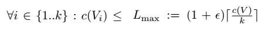
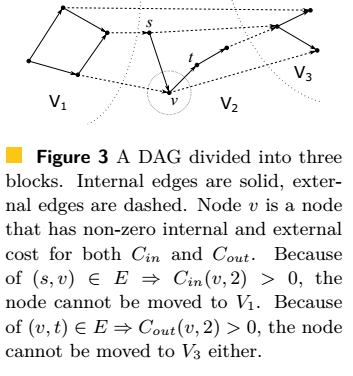
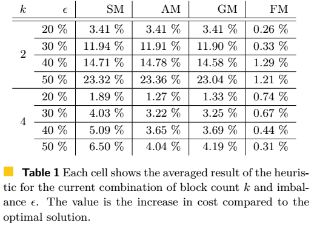
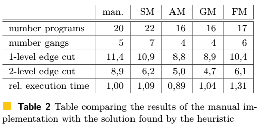
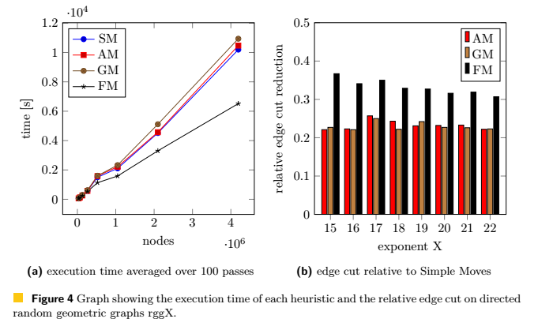

# Graph Partitioning with Acyclicity Constraints

## 1 Practical Motivation

+ 目标平台: 用于高级成像和计算机视觉的异构多处理器，目前用于英特尔处理器，为低功耗和小内存设计。
+ 为了解决内存限制，将图划分为几个分区依次执行。这种划分的质量对通信量和性能有很大影响。
+ 现有很多启发式算法可以将图划分成节点数量大致相等的分区。但是我们的平台要求分区之间的依赖不能成环，因为要依次执行。

## 2 Background

+ 把DAG的节点映射到异构嵌入式多处理器的PE（processing element）时产生了图划分问题。
+ 平台的PE拥有私有的本地数据存储器和独立的程序存储器。 直接存储器访问控制器用于在本地存储器和系统的外部DDR存储器之间传输数据。 数据存储器的大小约为几百千字节，只能存储一小部分图像。因此，输入图像被分成小片。 该硬件的操作模式通常是应用程序图中的节点被分配给PE并一个接一个地处理这些分区。 在大多数情况下，这可以流水线化，使得当PE处理当前分区时，直接存储器访问控制器同时将下一分区加载到本地存储器并将处理后的分区从先前的迭代写回主存储器。

## 3 Prelimitaries

+ 平衡约束：
  </img> 

+ 无环约束：分区之间不能有循环的依赖关系
+ 目标函数：
  </img> 

+ DGPAQ (directed graph partitioning problem with acyclic quotient graph) 可以定义为找到一个分割，在满足平衡约束和无环约束的条件下，使目标函数最小。
+ 平衡约束确保调度组中的程序的大小不超过平台的程序存储器大小。减少边缘切割减少了组之间的数据传输量，从而减轻了应用程序的内存带宽要求。请注意，应用程序要么是计算限制的（处理器总是占用），要么是带宽限制的（处理器等待数据）。因此，最小化传输并不能保证最佳的调度。但是，特别是在嵌入式系统中，内存带宽通常是瓶颈，需要大量传输的调度既不会产生良好的吞吐量，也不会产生良好的能效。因此，我们解决了在给定约束下单独最小化边缘切割的问题，但没有解决调度问题。我们提供线性时间启发式算法，以后可以在更广泛的调度算法中用作子程序以减少数据传输。

## 4 Hardness Results

+ 当限定 k = 2，epsilon = 0 时，这个问题是NP完全问题，而且 k >=3 时，难以用有限近似因子近似。通过构造商图Q，检查平衡约束并检查Q的无环性，可以在线性时间内验证DGPAQ实例的给定解。最后一项任务可以使用Kahn算法在Q的大小的线性时间内完成。 我们现在将子集和问题归约为我们的问题。 最平衡的最小割问题是NP完全的。
+ 定理一 ：epsilon = 0 时的二分情况下，DGPAQ问题是NP完全的。
+ 定理二 ：epsilon = 0，k >= 3 时， DGPAQ没有多项式时间的近似算法，除非 P = NP。

## 5 Heuristic Algorithms

本节提出简单但高效的构造和局部搜索启发式算法来解决问题。大致方法是：现基于输入图的拓扑排序创造一个初始解，然后在保证两个约束的同时，利用局部搜索策略来改进解的目标。

### Construction Algorithm

我们所有局部搜索启发式算法都从一个满足两个约束的初始划分开始，也就是商图无环且满足平衡条件。

用随机切断连接的Kahn算法的修改版本计算节点的随机拓扑序来实现这个目标。更准确的说，算法利用一个用所有入度为零的节点初始化的列表S和一个空列表T，然后重复以下步骤直到S为空：S中随机均匀地选择一个节点并将其从列表中删除。将节点添加到T的尾部。删除节点的所有出边。如果这使另一个节点的入度减少为零，则将其添加到S。当算法终止时，列表T是所有节点的拓扑排序，除非图有环。

使用列表T，我们现在可以通过将图按顺序划分为连续节点的分区来获得初始解。由于拓扑排序的特性，分区Vj中没有节点具有以分区Vi结尾的出边，其中i < j。因此，我们的解决方案的商图是无环的。另外，选择分区以满足平衡约束。显然存在大量可能的分区。我们的算法通过将排序分成大小为从c(V)/k的分区来随机均匀地生成平衡的初始分区。由于构造算法是随机的，我们使用不同的初始分区运行启发式时间，然后选择最佳解决方案。

### 局部搜索算法

我们的局部启发式算法需要一个给定的初始解，然后在分区之间移动节点来减少边割。一次移动后减少的边割称作这次移动的增益。为了计算移动节点v的增益，我们定义两个函数：

  </img> 

Cin是所有从分区Vi中的节点开始，并以节点v结束的权重。类似地，Cout是从节点v开始并连接到分区Vi内节点的所有边的权重。如果v∈Vi，这些代价就是内部边的权重。如果将v移动到不同的分区，这些边将成为外部边并增加目标函数。如果v∈Vj,j != i，则这些代价是外部边缘的权重，如果v移动到vi，则外部边缘将变成内部，从而减少边割。下图显示了内部和外部边缘的示例。

  </img> 

我们有多种局部搜索启发式算法，区别在于局部搜索邻域的大小：简单移动(Simple Moves)、高级移动(Advanced Moves)、全局移动(Global Moves)以及FM移动(FM Moves)。我们发现启发式方法通常可以在不同的初始分区中产生更好的结果。为了比较不同的启发式算法，我们将给每个启发式算法相同的时间预算，并重新启动不同初始分区的启发式算法，直到时间耗尽。

#### Simple Moves (SM)

先选择一个节点v，如果这不违反约束条件并且能改善目标，就将其移动到另一个分区中。SM启发式算法只考虑将节点 v ∈ Vi 移动到相邻分区 Vi−1 和 Vi+1。这是因为有一个快速算法来检查无环约束。假设给定解对于这两个约束都是可行的，如果我们想把v移动到Vi+1，那么只要检查是否Cout(v,i)=0；如果想把v移动到Vi-1，那么只要检查Cin(v,i)=0。节点移动的增益取决于分区，计算如下：

  </img> 

如果移动不产生环且分区不超载，那么分区就是合适的。此外，增益必须为正，或者为零但可以改善分区的平衡。如果存在这样的分区，就将v移动过去。如果这次移动对两个分区都合适，并且有相同的增益，算法会随机均衡地选择其一。

对所有节点重复这种处理。当没有节点能带来正增益或者改善平衡是，算法停止。因此，在局部搜索邻域得到局部最小值时，算法终止。注意，虽然边割不是严格单调低递减，但是边割和分区权重差异的组合是单调递减。在一次传递中，启发式方法考虑了所有节点的入边和出边。因此，每个边被考虑两次以计算所有节点的增益，启发式算法的复杂度为每轮O(m)。

#### Advanced Moves (AM)

比SM算法扩大了局部搜索邻域的范围。对于节点v ∈ Vi，检查所有入边以找到节点u∈VA，其中A是最大的。 还检查所有出边以找到节点w∈VB，其中B是最小的。 因为初始分区由拓扑序得到，A<=i<=B一定成立，非则排序中会有后向边就不可能是拓扑序。

如果A = i = B，则节点v在此分区中既有入边又有出边，不能移动。

如果A < i，那么节点可以从移动到拓扑序中Vi之前的分区，包括VA，而不会产生环。这是因为节点的所有入边要么在分区VA内要么是来自分区VA之前的其他分区的前向边。因此仍然是拓扑序。但是如果节点移动到VA之前的分区，那么从这个分区开始的边就会变成后向便，排序也不再是拓扑序了。

如果i < B，那么节点可以移动到Vi之后的分区包括VB。

因此，节点可以移动到分区Vj，其中 j ∈ {A, . . . , B} \ {i} ，同时可以维持分区的拓扑序。

这是确保无环约束的充分条件，并且检查的计算代价不高。 但是，由于它不是必要条件，因此可能会阻止启发式尝试某些可能的移动。 全局移动启发式GM没有此限制，但具有更高的计算复杂性。

使用上一节中描述的代价函数Cin(v,j) - Cout(v,i) + Cout(v,j) - Cin(v,i)计算所有允许的Vj的移动增益。 在每次迭代中，选择具有最大增益的移动以便保持约束。 打破平衡和零增益的处理方式与简单移动相同。 该启发式算法将每个边考虑两次，以便在将节点移动到任何其他分区时计算增益。 然后，选择产生最大增益的分区，这可以在与节点的程度成比例的时间内完成。 因此，这种启发式的复杂性是O(m)。

#### Global Moves (GM)

将局部搜索邻域扩大到所有分区。从初始分区开始，算法计算商图的邻接表。在整个算法中，商图不断更新。 移动节点时，我们更新商图的邻接信息，并记录是否已创建新边。 如果是这种情况，我们使用Kahn算法检查商图是否存在环，并在创建环时撤消上次移动。

其他启发式算法计算增益可以在O(m)完成。在最坏情况下，GM算法会检查所有可能移动的无环约束。Kahn算法检查商图的无环性，启发式算法总的复杂度是O(m(mQ+k))，其中mQ是商图中边的数量。如果商图稀疏，也就是mQ在O(k)，那么复杂度为O(km)。

#### FM Moves (FM)

将AM算法的无环性的快速检查和一种改进的Fiduccia-Mattheyses算法结合起来，使得算法可以跳出局部最小值。通过交换一对分区之间的节点（即使增益为负）可以改进初始划分。最后会返回传递过程中有着最佳目标函数的划分。

传递从两个分区A，B开始，其中在拓扑序上A在B之前。然后算法将计算启用的边界节点移动到另一个分区的增益。使用与高级移动启发式方法相同的标准来保证无环性，如果边界节点位于A中，并且没有到B分区之前的节点的出边，或者它位于分区B中，并且没有来自A后面的节点的入边，则启用该边界节点。 候选移动，包含增益和节点标识符，被插入优先级队列。 队列是二叉堆，其中元素的总排序是通过比较移动的增益来实现，如果增益相同，则是插入时生成的随机数。

在一个运行到优先级队列耗尽的循环中，第一个移动是从队列中提取的。如果所选移动将超载目标分区或由于在上一个循环迭代中禁用而未启用，则启发式操作将继续进行下一个迭代。否则，即使增益为负，移动也将被执行。然后，节点被锁定，即在此过程中不能再次移动。这可以防止抖动并保证算法的终止。与Fiduccia Matthyses算法不同，这种情况下的移动不会改变增益，它可以禁用和启用其他移动。

例如，如果一个节点w从A移动到B，启发式算法将禁用分区B中的所有节点v(w，v)∈E，因为它们不再满足无环的条件，并且将它们中的任何一个移动到A将在块的拓扑序中引入一个后向边。这并不一定意味着商图会变成有环图，但是，要确保这一点，需要像Kahn算法那样进行更昂贵的检查。注意，移动增益不需要重新计算，因为w被锁定，因此在此过程中所有节点v都不会再次启用。

另一方面，移动w将启用节点，如果A中的节点与w的出边相连，而且如果移动后，A中的节点没有其他出边到分区B之前的分区。算法将计算这些节点的增益，启用并将其插入优先级队列。从B到A的移动将相应地启用和禁用移动。循环将继续在分区之间移动节点，直到优先级队列耗尽，这发生在禁用或锁定所有节点的时候。由于移动的重新插入很难预测循环迭代次数，因此它被限制为2n/k，这对获得的分区的质量没有明显影响。记录过程中实现的最佳目标。在最后一步中，如果需要到达相应的分区，最后的移动将被撤消。这终止了启发式的内部传递。

算法的外部传递将重复随机选择的一对分区的内部传递。 这些分区中的至少一个必须是“活跃的”。 最初，所有分区都标记为“活跃的”。 当且仅当内部传递导致节点移动时，两个块将被标记为活跃以用于下一次迭代。 如果没有活跃分区，则算法停止。

计算增益的总时间为O(m)。现计算一堆分区的运行时间。在最坏情况下，两个分区的所有节点在开始都会被启用，用2n/k个节点初始化优先级队列需要O(n/k)的时间。注意不能用桶优先级队列bucket priority queue，因为边上的权重可能或多或少是随机分布的。从队列中删除增益最大的一个节点的需要O(log(n/k))时间，如果一次迭代中提交了一次移动，算法需要计算相邻节点的增益。但是算法不会在一次传递中计算一个移动两次。因此，内部传递总的复杂度是O(n/k\*log(n/k))。注意每对分区之间都需要执行内部传递，每轮算法的总的时间是O(m+mQ\*n/k\*log(n/k))，商图稀疏时为O(m+nlog(n/k))。

## Experimental Evaluation

首先介绍评估方法和系统。 通过将其与最优解决方案进行比较来评估小实例的解决方案，并评估算法在复杂成像滤波器上的表现，最后对算法的可扩展性进行测试.

### Methodology

+ C++
+ g++ 4.8.0
+ 32 bit index data types (32位索引数据类型)
+ Intel Xeon X5670 Hexa-Core processor (westmere) 2.93GHz
+ 128GB主存，12MB L3-Cache，6*256KB L2-Cache

### Comparison with Optimal Solution

与穷举法计算所得的最优化分结果作比较。生成一组接近实际应用的随机图，我们的生成算法用随机数量的节点连续增加新的图级别。每个新节点都连接到前一级别中任意数量的节点上。因为这项工作的应用领域是成像，所以我们使用少量的输入和输出节点（在1到3个之间），这是成像和视觉kernel的典型情况（比较OpenVX视觉函数库）。由于节点的权重代表程序的大小，因此在目标平台的局部拉普拉斯滤波器的实现中，我们在最小和最大kernel的大小之间选择一个随机值。考虑函数之间的中间缓冲区的大小不同，边缘的权重统一选择在1到100之间。

参数选择对图的结构有很大影响，选择了两个数值，8个结果参数的组合每种生成25个图：

+ 图等级的最大尺寸要么设置为一个高值(√n)，这将导致一个在极端情况下具有√n级别的图形，每个节点约为√n，这意味着存在大量的数据并行性；要么设置为一个低值(4√n)，这样图形就更像一个长链的节点，因此代表了经典的成像管道，在内核级别上具有低数据并行性。
+ 最大边数要么设置为确保内部节点至少有一个传入边和一个传出边且图形已连接的最小边数；要么设置为每个节点有√n条边，以便边数随问题大小缩放。这代表了函数之间数据依赖性很少或多的应用程序。
+ 节点索引的最大距离(新节点连接到图中的前一个节点)要么设置为低值，得到一个图，其中节点只有来自最近的前一级分区的传入边；要么设置为n表示边开始的节点没有限制。 第一种情况模拟了数据寿命短暂应用程序，数据仅在管道中的下一步用到，而第二种情况表示具有长数据寿命的情况。

这200个不同的实例的节点数量在10到20之间。下表显示了当使用10毫秒的时间预算时，四种启发式算法的平均近似因子。

  </img> 

穷举搜索算法的运行时间在小实例的几秒钟和大实例的几天之间变化。结果表明各种算法都很好的逼近最佳结果，并且搜索范围越大，效果越好。当epsilon比较大时，SM、AM、GM算法的质量因为陷入了局部极小值而变差。

### Local Laplacian Filter

我们将滤波器的数据流建模为一个DAG，其中节点表示简单的函数原语，例如，在金字塔生成的每个级别上，对两个图像维度进行上采样、下采样和高斯滤波。

如果两个节点之间存在直接的数据依赖关系，则它们由一条边连接，该边的权重为相应缓冲区的像素数。节点权重设置为原语使用的程序内存。DAG在我们的配置中总共有72个节点和93个边缘。

在现有的实现中，原语由开发人员以功能性方式（例如金字塔生成）分组到程序中，然后分配给总共五个调度组。为了评估启发式方法，我们使用Lmax设置为程序存储器大小的第一次传递来找到程序中函数原语的良好组合。然后在第二次传递中使用得到的商图，其中Lmax被设置为PE的总数，以便找到最小化外部存储器传输的调度组。在第二次传递中，无环约束至关重要。在这两个过程中，明确允许空分区允许算法来减少组的数量。每个启发式算法的时间预算是一分钟。

我们还发现，由于（期望的）编译器的优化，程序的最终程序内存大小可以小于其原语的总和。

由于分区、代码生成和编译的整个过程都是自动化的，所以我们利用了这一点，慢慢地增加epsilon，直到程序变得太大。结果如下表所示。

  </img> 

1级边割显示程序之间的通信量，以及组之间的2级边缘切割，均以百万像素为单位。

通过硬件平台的循环真编译模拟器获得循环计数。由于组是依次地执行的，所以组中程序的最长执行时间限制了吞吐量。该表显示了与手动执行相关的每个限制程序的执行总和，不考虑带宽限制，以便了解何时计算限制时间表。所有的启发式方法都将边割改善了至少30%，因此，在手动实现带宽受限的所有平台上，该计划都将更优越。

此外，通过减少边割，AM和GM启发式算法能找到需要较少组的分区。对于AM，这提高了执行时间，因此即使带宽不是限制因素，调度也会更好。对于GM来说，启发式算法做了一个额外的选择，进一步减少了边割，但是不能很好地平衡计算密集型程序，因此调度时间没有得到改善。这在我们的图分区启发式算法中没有得到解决，应该在调度算法中加以考虑。

### Random Geometric Graphs

在随机几何图上检测启发式算法的可扩展性。其中节点表示单位方格中的随机点，边连接了欧几里得距离低于0.55√((ln n)/n)的节点。选择此阈值是为了确保图基本上连接。这些图取自[3](Benchmarking for Graph Clustering and Partitioning)，最初是无向的。我们通过令边从ID较小的节点指向到ID较大的节点，将它们转换为DAG。图rggX有2^X个节点。在[15,…,22]范围内改变x。允许的不平衡被设置为3%，因为这是在[26](A Multilevel Balancing and Refinement Algorithm)中使用的值之一。图4显示了每种算法运行100遍所需的平均时间，以及k=8时与简单移动启发式相比，更高级的启发式的边切割相对改进。

  </img> 

该图显示了我们的启发式算法运行时嫁相对于节点数呈线性增长。如果假设所有节点都是边界节点，那么fm移动的最坏情况复杂度为超线性，但是这在这里并非如此。我们得出的结论是，我们的算法可以很好地扩展到较大的问题。

## Conlusion

结果表明，约束问题是NP完全问题，启发式方法对小问题的最优解有很好的逼近，对大问题的最优解的差距呈线性增长。通过模拟，可以显示所有启发式算法对实际应用的通信量都有积极作用，在其中一个例子中，当带宽不受限制时，甚至出现了执行时间随着调度组数量减少而减少。启发式算法w.r.t到问题大小的运行时间对于这个应用程序域是足够的，特别是因为算法只需要在编译时运行。此外，通信量也有所减少，这表明在未来的工作中，通过更好地平衡计算密集型kernel，引入有助于改进成组执行时间的其他目标将更有意义。
