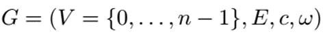
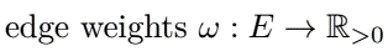
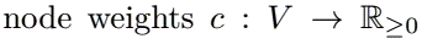
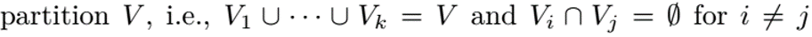
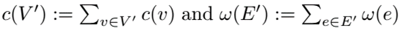
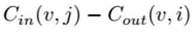
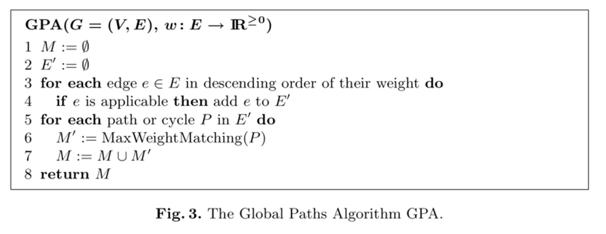
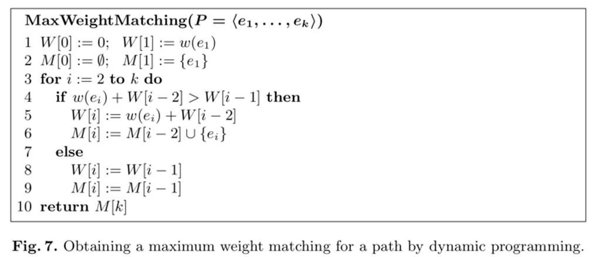
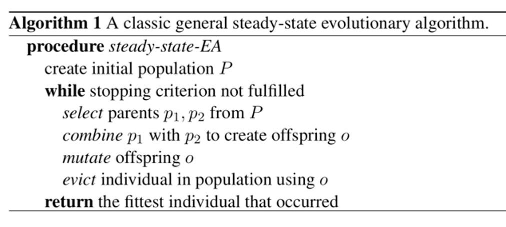

# 图划分算法说明文档

目前调研的几种对于有向无环图的划分算法的大致思路：

+ 启发式算法（单级算法）：以拓扑排序作为初始划分，在局部邻域分区之间移动节点，得到更加优化的划分。
+ 多级算法：对不同级别的图，逐级用启发式进行优化。
+ 进化算法：把划分看作种群中的个体，进行演化，演化需要用到多级算法，最终得到更优秀的划分。

## 基本概念

### 定义

G：有向无环图，有n个节点，m条有向边，V为节点的集合，E为边的集合。节点和边的权重都要求大于等于零。

 </img>

 </img>

 </img>

分区之间不能有公共节点。

 </img>

一个分区的大小，用分区内部所有节点的权重之和表示。

 </img>

如果一个分区的大小超过限制Lmax，称为超载。

 </img>

### 划分的约束与目标

+ 平衡约束：

  </img> 

+ 无环约束：分区之间不能有循环的依赖关系
+ 目标函数：

  </img> 

### 增益

增益表示一个节点的移动对目标函数能带来的优化。一次移动带来的增益主要取决于该节点来自于目标分区的入边，以及该节点指向原所在分区内部的出边。前者可以带来正的增益，后者带来负的增益。为此定义两个函数：

  </img> 

第一个式子，表示节点v移动到分区Vi带来的增益。第二个式子，表示节点v从分区Vi移除后减少的增益。所以如果节点v从Vi移动到Vj，那么带来的增益就是

  </img> 

## 启发式算法

**参考文献**：Moreira O , Popp M , Schulz C . Graph Partitioning with Acyclicity Constraints[J]. 2017.

包含Simple Moves，Advanced Moves，Global Moves, FM Moves。这几种算法都以拓扑排序作为构造算法，区别在于局部搜索的范围不同。是要设定分区个数k，和不平衡参数𝜖。

## 构造算法

我们选择用修改版本的Kahn算法计算图的拓扑序。

Kahn的思想是：

+ 从有向图中选取一个没有前驱的顶点，并输出之；
+ 从有向图中删去此顶点以及所有以它为尾的弧；
+ 重复上述两步，直至图空，或者图不空但找不到无前驱的顶点为止。没有前驱，即入度为零，删除顶点及以它为尾的弧，即弧头顶点的入度减1。

具体实现：

算法利用一个用所有**入度为零**的节点初始化的**列表S**和一个**空列表T**，然后重复以下步骤直到**S为空**：

+ S中**随机均匀**地选择一个节点并将其从列表中删除
+ 将节点添加到T的尾部，删除节点的所有出边。
+ 如果这使另一个节点的入度减少为零，则将其添加到S。

当算法终止时，列表T是所有节点的拓扑排序，除非图有环。

然后将排序分成k个大小约为c(V)/k的分区。c(V)代表图中所有节点权重之和，要求各个分区的权重接近，满足平衡约束。这就作为后续操作的初始划分P={V1, V2, ..., Vk}。

## Simple Moves

搜索范围限定在当前节点所在分区的**前后两个相邻分区**，相邻是指在拓扑序意义下的分区顺序。即属于Vi分区的节点v，仅考虑将其移动到Vi-1或Vi+1。

首先要保证移动不会打破两个约束，然后再决定是否移动，以及接受哪个方向的移动。最终接受的移动一定能带来**正的增益**或者**增益为零但能改善分区平衡**的移动。

如果两种移动都满足条件，选择增益较大的；若两者增益相同，随机选择一个移动。

每个节点最多进行一次移动。

## Advanced Moves

搜索范围扩大。

计算移动范围的方法：对于节点v ∈ Vi，检查所有入边以找到节点u∈VA，其中A是最大的。 还检查所有出边以找到节点w∈VB，其中B是最小的。节点可以移动到分区Vj，其中 j ∈ {A, . . . , B}\\{i}。这样的范围，可以保证移动后不会违背无环约束，因此不需要进行无环检查。

 因为初始分区由拓扑序得到，A<=i<=B一定成立，否则排序中会有后向边就不可能是拓扑序。

假设节点v从Vi移动到Vj，计算增益的公式：

  </img> 

注意：当j < i时，后两项必然为零；当i < j时，前两项必然为零。否则移动前后的划分都存在环，违背了无环约束。

与SM相同，只考虑满足约束，并且能带来正的增益或没有增益但可以改善平衡的移动。优先选择增益最大的；若存在增益相同，则随机选择一个移动。

每个节点中最多进行一次移动。

## Global Moves

GM将搜索范围扩大到所有分区。这种情况更加复杂的原因是，不能保证移动节点后不会被违背无环约束，因此，对于每个移动都要检查是否满足无环约束。（AM算法的搜索范围是无环约束的充分不必要条件，可以保证移动后仍然无环，但是也因此可能忽略了一些可行的移动。）

检查划分是否满足无环约束的方法：从初始分区开始，维护商图的邻接表。在整个算法中，商图不断更新。 移动节点时，我们更新商图的邻接信息，并记录是否创建新边。 如果是这种情况，我们使用Kahn算法检查商图是否存在环，并在创建环时撤消上次移动。（商图，相当于把原图划分后的各个分区看作一个节点的图。）

移动的选择方法与之前一样。每个节点最多进行一次移动。

## FM Moves

前几种启发式的缺点是，很容易陷入局部极小值，为此结合AM和改进的Fiduccia-Mattheyses算法，是算法跳出局部极小值。

首先，节点的交换在**一对分区**之间进行，考虑其移动的节点称为启用的节点（enabled）。假设根据拓扑序，分区A在分区B之前，那么启用的节点为：

+ 属于A，且没有出边指向B之前的分区
+ 属于B，且没有入边来自A之后的分区

这保证了移动不会打破无环约束。

启用的节点到另一分区的移动为候选移动。将候选移动加入优先级队列，保存了移动的增益和节点标识，按照增益从大到最小排序，如果增益相同，则利用随机数进行排序（比较器可能需要自己实现）。

每次从优先级队列提取第一个移动，检查其是否可用以及是否会违反平衡约束，若可行，则提交该移动，并修改相邻移动的可用性，即相邻节点的启用或禁用状态。

如果所选移动将超载目标分区或由于在上一个循环迭代中禁用而未启用，则启发式操作将继续进行下一个迭代。否则，**即使增益为负，移动也将被执行**。然后，节点被锁定，即在此过程中不能再次移动。这可以防止抖动并保证算法的终止。（本轮内部传递结束后，锁定被解除）

状态修改规则：

+ If节点w从A移动到B，锁定w
  + 禁用B中所有满足(𝐰,𝒗)∈𝐄的节点v
  + 启用**A中拥有指向w的出边**&**移动w后没有其他出边指向B之前的分区**的节点
+ If节点w从B移动到A，锁定w
  + 禁用A中所有满足(𝒗,𝐰)∈𝐄的节点v
  + 启用**B中拥有来自w的入边**&**移动w后没有其他入边来自A之后的分区**的节点

新启用的节点，都要计算增益，并加入优先级队列。

当优先级队列为空时，这对分区间的节点移动结束，即**内部传递**结束。不过由于节点的重新插入，难以估计迭代次数，可以认为限制为2n/k，这不会明显影响分区质量。

**外部传递**将重复随机选择一对分区进行内部传递，但是要求所选的两个分区中，至少有一个分区是活跃的，即拥有一个可以启用的节点。当没有活跃分区时，算法停止。（也可以限制迭代次数）

## 多级算法

**参考文献**：

1. Sanders P , Schulz C . Engineering Multilevel Graph Partitioning Algorithms[J]. 2011.
2. Holtgrewe M , Sanders P , Schulz C . Engineering a scalable high quality graph partitioner[C]// Parallel & Distributed Processing (IPDPS), 2010 IEEE International Symposium on. IEEE, 2010.
3. Moreira O, Popp M, Schulz C. Evolutionary Acyclic Graph Partitioning[J]. 2017.
4. Maue J , Sanders P . Engineering Algorithms for Approximate Weighted Matching[C]// Experimental Algorithms, 6th International Workshop, WEA 2007, Rome, Italy, June 6-8, 2007, Proceedings. Springer-Verlag, 2007.

分为三个步骤：

+ 初始划分
+ 粗化
+ 去粗化（精化）

### 初始划分

设定k, 𝜖用启发式算法（选择其一）得到初始划分。详情参上一部分内容。

### 粗化

通过对边进行收缩，让“**大图**”变成“**小图**”，得到较为“粗糙”的图。

收缩（contract）的定义：
收缩边{u, v}，则删去节点u和v以及邻边，用新节点x代替节点u和v。

+ 新节点权重  c(x) = c(u) + c(v)
+ 新边权重    w({x,w}) = w({u,w}) + w({v,w})

当图足够小时，收缩停止。对于小的定义，是指足够用简单的算法进行划分，论文给出一个参考值：当节点数小于max⁡(60𝑘, 𝑛/(60𝑘))。不过用在我们的项目中这个范围肯定要进行修改，最好通过实验进行确定。

下面介绍如何选择进行收缩的边。有两个部分，评分函数和匹配算法。

+ 评分函数：基于局部信息，衡量收缩该边的意义有多大。
+ 匹配算法：基于全局结构，最大化收缩边的总分。

#### 评分函数

如果想要简单的评分函数，可以选择边的权重w({u,v})，但是这样考虑会过于片面，可以考虑上两端节点。

我们倾向于收缩权重较大的边，因为权重较大的边往往不会考虑被切割，并且倾向于收缩权重更小的节点，为了让各级收缩后的节点的权重比较相近。

因此选择如下的评分函数：

  </img> 

#### 匹配算法

采用GPA(Global Paths Algorithm)，结合了greedy algorithm & Path Growing Algorithm。

算法伪码：

  </img> 

Line 4，applicable的含义:

+ 如果边连接不同路径的两个端点 或者 奇数长度路径的两个端点，则称为“适用”。
+ 如果边使路径形成奇数长度的环，或者它与连接现有路径的内部两个节点，则边“不适用”。

Line6，扫描所有边缘后，将为每个路径和循环计算最大权重匹配MaxWeightMatching：

  </img> 

#### 去粗化（精化）

逐层解除之前匹配的收缩，在不同级别的图上用启发式算法进行优化，实现精化。

具体每次解除哪些匹配，多少匹配没有详细规定，依据划分的要求设定。如果要求高，可以分多次解除，反之可以用较少次数完全接触匹配。

## 进化算法

参考文献：

1. Moreira O, Popp M, Schulz C. Evolutionary Acyclic Graph Partitioning[J]. 2017.
2. Sanders P , Schulz C . Distributed Evolutionary Graph Partitioning[J]. Computer Science, 2011, 31(29):1958-1960.

把现有的解作为父代，生成更优的子代，类似进化的过程，繁衍多代，最后得到结果。每种划分作为个体，多个个体组成种群产生进化。

进化算法从一群个体开始，这里是图的分区，由我们使用多级算法利用不同随机种子创建。然后使用重组和突变操作将种群进化为几轮不同的种群。在每一轮中，进化算法使用二路锦标赛选择规则，基于种群个体的适应性来选择好的个体进行重组或突变。在这里，选择来自种群的两个不同随机个体中的最适合的。我们专注于一个简单的进化方案，每代产生一个后代。当生成后代时，我们使用驱逐规则来选择种群的成员并将其替换为新的后代。一般来说，人们必须同时考虑个体的适应性和种群中个体之间的距离。我们驱逐的目标是群体中与后代最相似的，并且划分更差或与后代本身相同的个体。两个个体的差异被定义为它们的切割边缘组之间的对称差异的大小。

算法思路伪码：

  </img> 

### 交叉重组

由两个父代生成一个子代。

一个父代是从种群中选的，另一个父代是算法在第一个父代的基础上生成的。

第一个父代：用2-way锦标赛算法从种群中选出。也就是从种群中随机选出两个个体，进行锦标赛，冠军作为选出的父代。

第二个父代：根据第一个父代的k,𝜖，随机选择𝑘′∈[𝑘/4,4𝑘]，𝜖′∈[𝑘/4,4𝜖]，使用多级算法生成满足平衡约束（max⁡ 𝑐(𝑉𝑖) ≤ (1+𝜖′)𝑐(𝑉)/𝑘′ ）的分区。

用多级算法生成子代。先进行粗化，两个父代的割都不会收缩，剩下的边按照多级算法进行收缩。将两个父代中较好的划分作为初始化分，再进行精化。如果两个父代一样好，随机选一个做初始划分。

局部搜索算法可以通过仅移动几个节点来有效地在粗略级别上交换解决方案的好部分。 由于我们的多级算法是随机的，使用相同父母执行两次的重组操作可以产生不同的后代。 每次我们执行重组操作时，我们都会随机选择之前描述的局部搜索算法之一。

### 突变

我们定义了两个突变操作。两个突变操作都使用来自当前种群的一个随机个体P1。第一个操作从使用多级方案创建k分区p2开始。然后，它执行如上所述的重新组合操作，但在最粗糙的级别上不使用两个分区中的较好分区，而是使用p2。第二个操作确保不降低质量。它基本上将p1与自身重新组合（通过设置p2=p1）。在这两种情况下，所产生的后代使用上述驱逐策略插入种群。

### 适应函数

评估个体的适应程度。没有确定的表达式，应当为边割和执行时间关键路径的线性组合。通过识别每个组中运行时间最长的程序并总结它们的执行时间来估计整个应用程序的关键路径长度。

### 并行杂化

同时创建多个PE（每个PE都包含一个种群），每个PE并行执行。每个种群都是用不同的随机种子利用多级算法创建。并行通信协议类似于随机谣言传播。 在每轮中，PE在尚未接收P的个体中随机统一选择通信伙伴，并发送当前种群的当前最佳分区P。之后，PE检查是否有进入的个体，如果是，则使用上述驱逐策略将它们插入到局部种群中。 如果P得到改善，所有PE再次符合条件。

E的数量S取决于计算一次划分的时间，通常时间越长，S越大。两个PE之间会传递best个体，传播对象是随机选择的。

  </img> 
