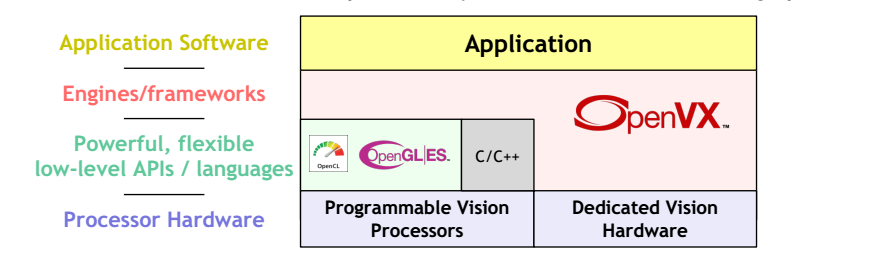
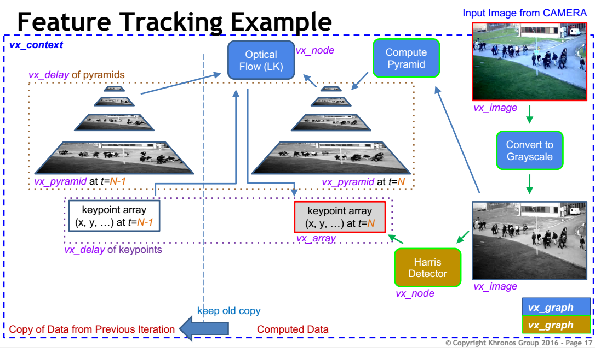
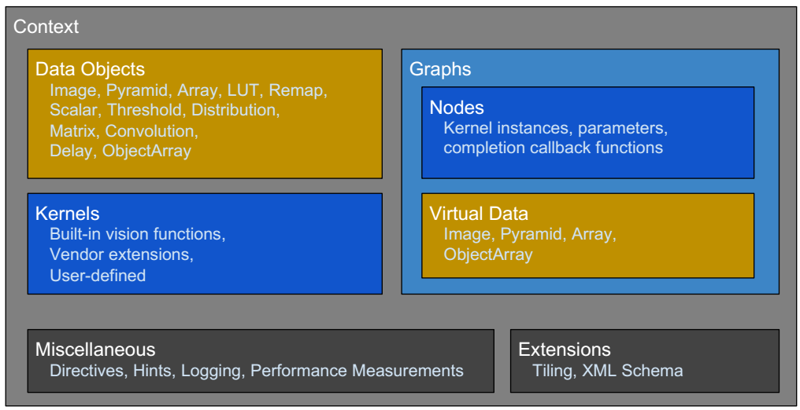

# OpenVX Ecosystem Overview
## Page 1
点明主旨：**OpenVX 生态系统概况**
## Page 2
介绍了Khrono组织和Khrono标准：

Khronos是一个由100多家公司组成的行业联盟，创建免版税的开放标准API，使软件能够访问硬件加速图形，并行计算和视觉。介绍Khronos标准，包括openVX,openGL,Vulkan等。
## page 3
介绍了自己各个产品在处理视觉流程中的作用：

**视觉流程Vision Pipeline的挑战与机遇**
1. 日益增长的相机多样性：灵敏的传感器和相机控制生成图像流---OpenKCam
2. 多样的视觉处理器：使用有效加速来处理图像流---OpenVX
3. 传感器增多：将图像输出与设备的其他传感器数据结合---StreamInput

## page 4
介绍调用关系：

**视觉加速API森林**

1. 视觉框架神经网络库：HCBlas，cuDNN，OpenCV，clBLAS，OpenVX
2. 基于语言的加速框架：HCComplier AMD，NVIDIA CUDA，SYCL
3. 显式内核Explicit Kernels：OpenGL|ES，Vulkan，OpenCL
4. GPU、FPGA、DSP、专用硬件
## page 5
介绍了OpenVX和OpenCV的互补性，和当前同类产品进行对比：

**OpenVX和OpenCV是互补的。**

| |OpenCV|OpenVX|
|:------:|:----------:|:----:|
|实现Implementation|社区驱动的开源库|设计的开放标准API由硬件供应商实现|
|适应性 Conformance|广泛的OpenCV测试套件但是没有正式的采纳者计划|实现必须通过定义的适应性测试套件才能使用商标|
|一致性 Consistency|可用函数可能因实现/平台而异|所有核心功能必须在所有符合要求的实现中可用|
|视野 Scope|1000+种图像和视觉函数；丰富的相机API/接口|紧密关注移动视觉的核心硬件加速功能，但可扩展；使用外部/本地相机API|
|效率 Effieciency|基于内存的架构；每次操作需要读写内存|基于图的执行；优化计算和数据传输|
|典型应用 Typical Use Case|快速实验和原型设计--尤其在桌面上|在移动和嵌入式设备上生产开发和部署|
|嵌入式部署 Embedded Deployment|可复用代码|可调用API|

## page 6
介绍OpenVX的优势--低功耗：

**OpenVC-低功耗视觉加速**
+ 为视觉加速的生产部署提供精准定义的API
    + 定位实时移动和嵌入式平台
+ 是比OpenCL更高的抽象，实现跨多种架构的性能可移植性
    + 多核CPU、GPU、DSP和DSP阵列，ISP，专用硬件
+ 将便携式视觉加速扩展到极低功率域
    + 不需要高功率CPU / GPU复杂度或OpenCL精度
    + 低功耗主机可以设置和管理帧速率图

## page 7
引入OpenVX的图：

+ OpenVX开发者提出图像操作的图（节点Node）
  + 节点可以用任何语言编码，存在于任何硬件和处理器上
+ 图基本可以自动执行
  + 可以在执行帧率图时最小化主机交互
+ 图时运行时优化机会的关键

## page 8
介绍图的优点：

**图可以为OpenVX提高效率。**

1. 图调度：跨越整个系统（CPU/GPU/专用硬件）划分图执行---更快执行或者更低功耗
2. 内存管理： 重新利用为许多中间数据预分配的内存---较少分配开销，为其他应用提供更多内存
3. 内核合并：用单个更快的节点代替子图---更好的内存局部性，更少的内核启动开销
4. 数据Tiling：在tile粒度而不是image粒度执行子图---更好地利用数据缓存和本地空间

## page 9
介绍各个产品的使用顺序，结构：

**分层视觉处理生态系统**

可以使用OpenCL或Compute Shaders在可编程处理器上实现OpenVX节点，然后开发人员可以使用OpenVX使开发人员能够轻松地将这些节点连接到图形中。

  </img> 

OpenVX使图形能够扩展到包括不支持可编程API的硬件架构。

OpenVX图使实施者能够优化各种硬件架构的执行，从而降低功耗实施。

## page 10
宣布发行新版OpenVX

## page 11
简要介绍OpenVX1.1新特性：

**OpenVC有哪些新颖的地方？**
+ 扩展节点功能和增强图框架
   + 加上许多小改进和说明
+ 拉普拉斯金字塔
   + 计算摄影用例
+ 目标 - 实现异构设备的执行灵活性
   + 应用程序可以控制运行节点的加速器
+ 中值，膨胀核腐蚀图像滤波器
   + 包括自定义模式
+ 改进了与OpenVX对象的读写数据
   + 易于使用且不易出错
+ 改进用户内核扩展OpenVX的API
   + 更方便和灵活

## page 12
介绍各个版本的更新内容，发展过程：

**OpenVX路线图和安全关键API**
## page 14
介绍接下来的演讲结构：
+ 实践编程部分Hands-on programming session
+ 简要概括OpenVX 1.1功能和新OpenVX扩展

# Hands-on programming session
## page 16
列出文档资源地址，以供观众查询：

产品说明书：www.khronos.org/registry/vx

指导手册：github.com/rgiduthuri/openvx_tutorial
## page 17
讲解一个图像处理实例，函数调用、数据传递的过程：

**特征追踪**

  </img> 

## page 18
介绍OpenVX的组成结构，用图像说明：

  </img> 

## page 19~page 42
从本页开始介绍OpenVX的各个组件，功能、特点、数据结构：
+ Context 
+ Error Management
+ Data objects
  + Data Object Creation
  + 各个data object的成员函数
+ OpenVX Graph
  + 内置Vision functions概览
  + 介绍几个比较重要的vision funciton的功能、参数
  + 用实例讲解以上组件是如何应用的
+ OpenVX Objects属性L特定信息可通过vxQueryType(...) API查询
+ 不透明的数据对象访问
  + 除非明确授权，OpenVX框架拥有数据的内存
  + 外部分配内存创建的图像，除非明确授权，OpenVX框架拥有这部分内存
  + 图像访问：write、view/edit OpenVX image，region of interest，内存布局
  + 数组访问：write，view/edit

## page 43
讲解执行图的流程：

 **循环执行图以处理输入**
  + 在执行Harris&Optical Flow Graphs之前: vxVerifyGraph() 需要返回 VX_SUCCESS (在循环外)
  + 在循环内：处理输入视频序列的每幅图像
    + 将输入视频中的像素写入输入RGB图像
    + 使用 vxProcessGraph() 执行图形
      +  第一帧：执行harris Graph
       +  其余：执行Optical Flow Graph
    +  读取上一个和当前的关键点并绘制
       +  使用 vxGetReferenceFromDelay() 访问数组
    +  把当前的pyramid和关键点成为上一个
       +  使用 vxAgeDelay() 
  + 在处理循环后
    + 查询 VX_GRAPH_ATTRIBUTE_PERFORMANCE 进行性能测量
    + 释放所有objects，context最后释放

## page 44
**总结**
+ OpenVX是一个低级编程框架，可以让软件开发人员:
   + 有效地访问计算机视觉硬件加速
   + 具有功能和性能可移植性
+ OpenVX包含：
   + 预定义和可定制的视觉功能库
   + 基于图的执行模型，具有任务和数据无关的执行
   + 一组抽象物理内存的内存对象
+ OpenVX定义为C API
   + 面向对象的设计
   + 同步和异步执行模型
   + 定义明确的扩展模式

# New Features in openVX 1.1
## page 46
内容与 page 11基本相同。

**OpenVX 1.1 新特性**：
+ 扩展节点功能和增强的图框架
   - 加上许多小改进和说明
+ 目标 - 实现异构设备的执行灵活性
   - 应用程序可以控制运行节点的加速器
+ 改进了与OpenVX对象的读写数据
   - 易于使用且不易出错
+ 拉普拉斯金字塔
   + 计算摄影用例
+ 中值，膨胀和腐蚀图像滤波器
   + 包括自定义模式
+ 改进的API，用于使用用户内核扩展OpenVX
   + 更方便和灵活
+ 新的OpenVX扩展
   + 卷积神经网络，二进制导入/导出

## page 47
介绍上面提到的中值，膨胀和腐蚀图像滤波器

**非线性滤波器**
+ 功能：中值，膨胀和腐蚀
+ 掩膜：预定义也可以自定义
+ 新API
  + vxNonLinearFilterNode：在图中创建非线性滤波器节点
  + vxCreateMatrixFromPattern：从布尔模式创建掩膜

## page 48
**用户内核和模块**

+ 使用新的视觉功能扩展OpenVX
+ 避免破坏执行流程，受益于一些图优化
+ 用户内核由四个回调函数实现
   - 参数验证器
   - 用于处理的主机端函数
   - 节点初始化器/取消初始化器（可选）
+ 可见：
   -  vxAddUserKernel
   -  vxLoadKernels
   -  vxGetKernelByEnum
  
## page 49
**OpenVX 神经网络扩展**

+ 卷积神经网络拓扑可以表示为OpenVX图
  + Layers表示为OpenVX节点
  + 通过多维张量对象连接的层
  + 层类型包括卷积，激活，合并，全连接，soft-max
  + CNN节点可以与传统的视觉节点混合
+ 导入/导出扩展
  + 高效处理网络权重/偏差或完整网络
+ 规范是临时的
  + 欢迎来自深度学习社区的反馈

## page 50
与page 44内容基本相同，再次总结。

**总结**
+ OpenVX是一个低级编程框架域，支持软开发人员在拥有功能和性能可移植性的同时，有效地访问计算机视觉硬件加速。

+ OpenVX包含：
   - 预定义和可定制视觉功能库
   - 基于图形的执行模型，用于组合函数，同时支持任务和数据无关的执行
   - 一组抽象物理内存的内存对象。
+ OpenVX定义为C API
   - 面向对象的设计
   - 同步和异步执行模型
   - 使用枚举和回调扩展功能