# PowerGraph：Distributed Graph-Parellel Computation on Natural Graph

## 图并行抽象

图的并行抽象包含一个稀疏图 G = {V,E} 和顶点程序Q，顶点程序Q在每个顶点v ∈ V上执行，并且可以和相邻实例 Q(u) 交互( (u，v) ∈ E )。与更一般的消息传递模型相比，图并行抽象限制了顶点程序与图结构的交互，从而实现数据布局和通信的优化。 我们将讨论重点放在Pregel和GraphLab上，因为它们代表了现有的图并行抽象。

### Pregel

Pregel是批量同步消息传送抽象，他的所有顶点程序同步运行在一系列super-steps。在super-step中，每个程序实例 Q(v) 从先前的super-step接收所有信息，并将信息发送到属于下一个super-step的邻居。为了确保所有程序在继续下一步之前都处理好来自前一个super-step的信息，需要在super-steps之间设置barrier。当没有消息要处理时并且每个程序都终止时,(barrier)程序终止。Pregel引入了可交换关联消息组合器（commutative associative message combiners），它是用户定义的函数，用于合并（merge）发往同一顶点的消息。 以下是Pregel中实现的PageRank顶点程序的示例。 顶点程序接收单个其包含所有邻居的PageRank的总和的传入消息（在组合器之后），然后计算新的PageRank并将其发送到其邻居。

```
Message combiner(Message m1, Message m2) :
  return Message(m1.value() + m2.value());
void PregelPageRank(Message msg) :
  float total = msg.value();
  vertex.val = 0.15 + 0.85*total;
  foreach(nbr in out_neighbors) :
     SendMsg(nbr, vertex.val/num_out_nbrs);
```

### GraphLab

GraphLab是一种异步的共享内存的分布式抽象，它的每个顶点程序共享所有存储在顶点和边的信息。顶点程序可以直接访问当前顶点、相邻的边，和边另一侧的顶点（无需考虑边的方向）。顶点程序还可以调度相邻顶点程序在未来的执行。GraphLab通过避免相邻程序实例同时运行来确保串行化。以下是GraphLab实现PageRank的例子。GraphLab顶点程序直接读取相邻顶点的值然后计算总和。

```
void GraphLabPageRank(Scope scope) :
  float accum = 0;
  foreach (nbr in scope.in_nbrs) :
     accum += nbr.val / nbr.nout_nbrs();
vertex.val = 0.15 + 0.85 * accum;
```

GraphLab通过消除消息隔离用户定义的算法和数据的移动，允许系统选择何时以何种方式改变程序状态。通过允许可变数据与顶点和边缘相关联，GraphLab允许算法设计者更精确地区分与所有邻居共享的数据（顶点数据）和与特定邻居共享的数据（边缘数据）。

### 描述

尽管GraphLab和Pregel中MLDM顶点程序的实现在如何收集和传播信息有不同，但是他们有相同的整体结构。为了表征这种共同结构并区分顶点和边缘特定计算，我们引入了图计算的GAS模型。

### GAS

GAS模型代表顶点程序的三个概念阶段：Gather，Apply和Scatter。

+ **G**ather
  
   在Gather阶段，通过在运行Q（u）的顶点u的邻域上的广义求和来收集关于相邻顶点和边的信息：
<div align = 'center'> 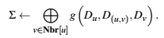 </img> </div>


+ **A**pply

  结果 Σ用于Apply阶段
更新中心顶点的值：
<div align = 'center'> 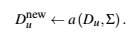 </img> </div>

+ **S**catter

    最后Scatter阶段用心的中心定点之来更新邻边的数据：

<div align = 'center'> 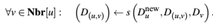 </img> </div>

顶点程序的扇入和扇出由相应的Gather和Scatter阶段确定。 例如，在PageRank中，Gather阶段仅在入度的边上操作，而Scatter阶段仅在出度的边上操作。 然而，对于许多MLDM算法，图的边的编码对称，其中Gather和Scatter阶段都接触所有边。 在这种情况下，扇入和扇出是相同的。图形并行抽象支持高扇入和扇出计算的能力对于自然图的有效计算至关重要。

GraphLab和Pregel表达GAS程序的方式非常不同。在Pregel抽象中，Gather阶段由消息组合器实现，Apply和Scatter阶段在顶点程序中表示。相反，GraphLab将整个邻域暴露给顶点程序，并且允许用户在他们自己的程序里定义gather和apply阶段。GraphLab通过确保顶点和边缘数据的变化对相邻顶点自动可见，来隐式定义了Gather和Scatter阶段的通信部份。值得注意，GraphLab不区分边的方向。

## 自然图的难点

...

### 平衡度 Work Balance

幂律度分布可能导致对称处理顶点的图并行抽象的实质工作不平衡。 由于Gather和Scatter阶段的存储，通信和计算复杂度在一定程度上是线性的，不同顶点程序的运行时间可能差异很大。

### 分区 Partitioning

自然图很难分区。GraphLab和Pregel的最小化通信和确保平衡都取决于图的分区。但是在自然图中，二者都必须用哈希函数随机分配，所以会导致很多节点被分配到很差的位置。

### 通信 Communication

自然图的偏斜度分布导致通信不对称并因此导致瓶颈。 此外，高度顶点可以强制消息传递抽象（如Pregel）生成和发送许多相同的消息。

### 存储 Storage

因为图并行抽象必须在本地存储相邻顶点的信息。每个顶点需要与度成正比大小的内存。因此，高度的顶点所需内存可能超过一台机器的内存容量。

### 计算 Computation

尽管多个顶点程序可能同时运行，但是现有的图并行抽象与不会在各个顶点内并行化，限制了高度顶点的可扩展性。

## PowerGraph抽象

PowerGraph通过直接利用GAS分解来分解边上的顶点程序，从而消除了顶点程序的度依赖性。 通过将Gather和Scatter阶段提升进该抽象，PowerGraph能够保留自然的“像顶点一样思考”理念，同时在整个集群上分配单个顶点程序的计算。

PowerGraph结合了Pregel和GraphLab的优点。PowerGraph从GraphLab借鉴了计算的数据图和共享内存思想，避免用户需要自己构建信息移动；从Pregel借鉴了可交换关联聚集概念。PowerGraph支持高度并行的批量同步Pregel计算模型以及计算高效的异步GraphLab计算模型。

像GraphLab一样，PowerGraph程序的状态根据用户定义的顶点数据Dv和边数据D(u,v)的数据图来决定。数据图中存储的数据包括元数据（如URL和边权重）以及计算状态（如顶点的PageRank）。

### GAS 顶点程序

PowerGraph抽象中的计算被编码为无状态顶点程序，该程序实现GASVertexProgram接口（下图），明确地考虑了聚集，求和，应用和散布函数。 

<div align = 'center'> 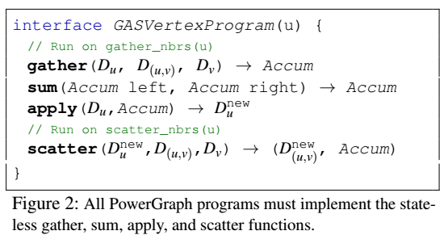 </img></div>

每个函数都由PowerGraph引擎按照算法1中的语义分阶段调用。通过对顶点程序进行分解，PowerGraph执行引擎可以在多台机器上分配单个顶点程序并将计算移动到数据。

<div align = 'center'>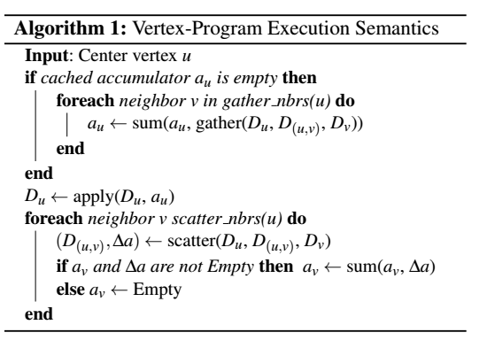 </img>  </div>

在Gather阶段，gather和sum函数用作映射并减少以收集关于顶点邻域的信息。 在与u相邻的边上并行调用gather函数。 特定的边集由gather_nbrs确定，其可以是none，in，out或all。 gather函数传递相邻顶点和边上的数据，并返回临时累加器（用户定义的类型）。 使用可交换和关联求和运算组合结果。 Gather阶段的最终结果au被传递到Apply阶段并由PowerGraph缓存。

Gather阶段完成后，apply函数接收最终的累加器，并计算出一个新的顶点值Du，它将会被原子地写回图。 累加器au的大小和apply函数的复杂度在确定PowerGraph抽象的网络和存储效率中起着核心作用，应该是次线性的并且在一定程度上恒定。

在Scatter阶段，在与u相邻的边上并行调用scatter函数，并产生新的边值D(u,v)并重写回数据图。和Gather阶段类似，scatter_nbrs决定了在特定的边集上调用scatter。scatter函数返回一个用来动态的升级相邻顶点的缓存累加器av可选值∆a。

下图使用了PowerGraph实现了网页排名PageRank、贪心图着色greedy graph coloring和单源最短路径算法SSSP。

PageRank中gather和sum函数手机相邻顶点的全部值，apply函数计算新的PageRank，scatter函数在必要的时候激活相邻的顶点程序；在图着色中，gther和sum函数收集相邻顶点的颜色集，apply函数计算出新的颜色，如果违反了着色限制，scatter函数将激活相邻顶点；在SSSP中，gather和sum函数计算经过每个邻居的最短路径，apply函数返回新的距离，scatter函数激活受影响的邻居。
<div align = 'center'> 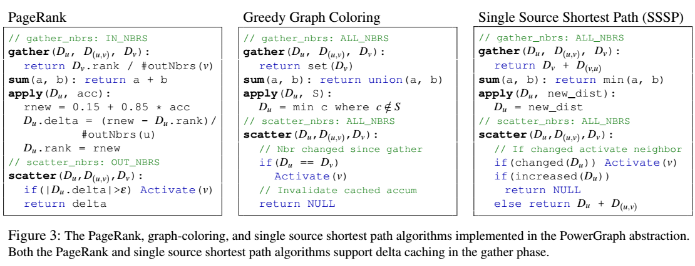 </img></div>

### 增量缓存 Delta Caching

很多时候，一些邻居的改变会启动顶点程序，然后gather操作就会在所有邻居上重复调用，然而大部分邻居是没有变化的，这就导致了无效的计算循环。很多算法有可动态的维护Gather阶段的计算结果au，略过后续迭代的gather。

PowerGraph引擎维护一个累加器au的高速缓存，au来自先前Gather阶段的各个顶点。scatter函数可以选择性的返回一个额外的 ∆a，可以用sum函数将其原子地加到相邻顶点v的缓存累加器av上。如果没有返回∆a，则邻居的缓存av将被清除，在后续v上的顶点程序上强制执行一个完整的Gather阶段。当执行v的顶点程序时，如果可以的话，PowerGraph会绕过Gather阶段,使用缓存的av。

...

### 初始化未来计算 Initializing Future Computation

...

+ 批量同步执行 Bulk Synchronous Execution

  同步运行时，PowerGraph引擎按顺序执行Gather，Apply，Scatter。每个阶段称minor-step，在所有活跃顶点上同步运行，最后有一个屏障barrier。 我们将super-step定义为一系列完整的GAS minor-steps。 对顶点数据和边缘数据所做的更改将在每个次要步骤结束时提交，并在随后的minor-step中可见。 在每个super-step中激活的顶点在随后的super-step中执行。

  同步执行模型确保了在人和机器数量下执行的确定性，这一点和Pregel很像。但是，频繁的barriers和无法对最新数据进行操作可能导致低效率的分布式执行和算法的缓慢收敛。为了解决这些局限性，PowerGraph也支持异步执行。

+ 异步执行 Asynchronous Execution

  异步运行时，PowerGraph引擎会在处理器和网络资源可用时执行活跃顶点。Apply和Scatter函数对顶点和边数据做出的改动过会立即提交到图上，并且对随后相邻顶点的计算也是可见的。

  因此，异步执行可以更高效地利用资源，并加速底层算法的收敛。例如，贪心图着色算法在同步执行时不会收敛，却在异步执行时快速收敛。可以证明异步计算为很多MLDM应用带来算法和系统性能方面的理论和经验上的益处。

  不幸的是，异步执行的表现取决以机器的数量和网络资源的可利用性，导致了不确定性，使算法设计和debug更加复杂。而且对于某些算法，比如统计模拟，如果不仔细控制，可能导致不稳定甚至分歧。

  为了解决这些问题，GraphLab实行可串行化：顶点程序的每个并行执行都有相应的顺序执行。这种可串行化对于很多MLDM算法已经足够了。为了实现可串行化，GraphLab利用细粒度锁协议来避免相邻顶点程序并行运行，需要依此抓取邻居定点上的锁。 此外，GraphLab使用的锁方案对高度顶点是不公平的。

  PowerGraph保留了GraphLab强大的可串行性，又解决了它的局限性。我们引入一种新的并行锁协议，它对高度定点也公平。另外，PowerGraph抽象暴露了更加精细粒度（边级别）的并行性，允许整个集群支持各个顶点程序的执行。
  
### 与GraphLab/Pregel对比

尽管PowerGraph抽象强加了约束，却可在其中模拟GraphLab和Pregel顶点程序。为了模拟GraphLab顶点程序，我们使用gather和sum函数来连接相邻顶点和边上的所有数据，然后在apply函数中运行GraphLab程序。类似地，为了表示Pregel顶点程序，我们使用gather和sum函数来组合入站消息（存储为边数据）并连接计算出站消息所需的邻居列表。 然后Pregel顶点程序在apply函数中运行，生成一组消息作为顶点数据传递给scatter函数，然后把数据写回到边上。

为了解决自然图的问题，PowerGraph抽象要求累加器的大小和apply函数的复杂度在一定程度上是次线性的。然而，在aplly函数内直接执行GraphLab和Pregel顶点程序会导致累加器的大小和apply函数复杂度在一定程度上呈线性，消除了自然图的许多益处。

## 分布式图布局 Distributed Graph Placement

PowerGraph抽象依赖分布式数据图来存储计算状态和编码顶点程序之间的交互。数据图结构和数据的布局在最小化通信和确保平衡性上发挥重要作用。

在包含p个机器的集群上分配图的一个常见方法使构建一个平衡p路边分割，其中顶点平均的分配到机器上，跨机器的边的数量最少。不幸的是，构建平衡边分割的工具在幂律图上的性能不太好。当图难以分割时，GraphLab和Pregel就只能用哈希（随机）顶点分布，而为了快速和容易的实现，它会切割绝大多数边。

+ **定理1**：
  
  如果顶点随机分配到p个机器上，则被切割的边的比例是：

<div align = 'center'> 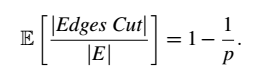 </img></div>

&emsp;&emsp;对于指数为α的幂律图，每个顶点的边数的期望是：

<div align = 'center'> 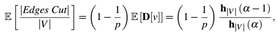 </img></div>

&emsp;&emsp;其中

<div align = 'center'> 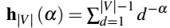 </img></div>

&emsp;&emsp;每次边分割都会产生存储和网络开销，因为两台机器都保存了相邻信息的副本，有时候还包括顶点和边上信息的镜像。一旦与切割边相连的顶点和边上的信发生息改变，就要通过网络进行同步。

### 平衡p路顶点分割 Blanced p-way Vertex-Cut

通过沿着图的遍划分顶点程序，PowerGraph允许单个顶点跨越多个机器。下图中，一个高度顶点程序被分在两台机器上，gather和
scatter函数在每台机器上并行运行，累加器和定点数据通过网络进行交换。

<div align = 'center'> 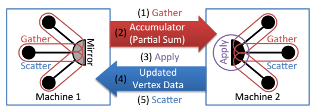 </img></div>

因为允许单个顶点跨越多个机器，PowerGraph就可以平均地将边分配到各个机器上，从而改善工作平衡度、减少通信和存储开销。每台机器只需要存储分配的边的信息。因为每条边制备存储一次，所以不需要传输边上信息的变化。不过顶点的变化必须拷贝到它所跨越的每台机器。所以存储和网络开销取决于每个顶点所跨机器的数量。通过限制顶点所跨机器数来最小化存储和网络开销。

定义顶点分割平衡目标：

<div align = 'center'> 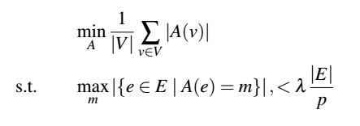 </img></div>

其中不平衡因子λ是一个小常量

.....
+ **定理2**：
  p个机器上的随机顶点分割具有一下复制期望：
<div align = 'center'> 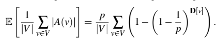 </img></div>
&emsp;&emsp;D[v]表示顶点v的度。幂律图的复制期望完全取决于幂律常数α：
<div align = 'center'> 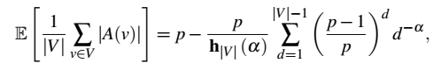 </img></div>
&emsp;&emsp;其中
<div align = 'center'>  </img></div>
&emsp;&emsp;虽然α越低意味着复制因子更高，但相对于边切割，顶点分割的有效增益实际上随着α的降低而增加。 最后，顶点切割模型对于常规图形也非常有效，因为如果可以找到良好的边缘切割，则可以将其转换为更好的顶点切割：

+ **定理3**：对于给定的g个镜像的边切割，任何沿着相同划分边界的顶点分割都严格少于g个镜像。

### 贪心顶点分割 Greedy Vertex-Cuts

通过对边的分配过程去随机化，可以改进随机构建的顶点分割，得到了顺序贪心启发式算法，它将能够最小化条件期望复制因子的下一条边分配在该机器上。考虑在分配i条边后，如何防止第i+1条。我们用条件期望定义目标：

<div align = 'center'> 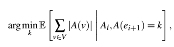 </img></div>

其中Ai代表前i条的任务。用定理2评估上式，可以得到以下边(u,v)的分配规则:
+ 如果A(u)和A(v)相交，这条边应该被分配到一个交叉点的机器上。
+ 如果A(u)和A(v)非空也不相交，这条边应该被分配到其中一个节点的机器上，要满足这个顶点还没有分配很多的边。
+ 如果当前只有一个顶点被分配，那这条边就被分配到那个节点的机器上。
+ 如果两个顶点都没有被分配，那么这条边就分配到边最少的机器上。
 
贪心启发式算法是一种去随机化，可以保证获得一个不会比随机分配更差的预期复制因子，并且在实践中可以更好。考虑两种分布式实现：

+ **Coordinated**：在分布式表格中维护Ai(v)的值。台机器运行贪心启发式算法并定期更新分布式表。 本地缓存用于减少通信，牺牲了Ai(v)估计的准确性。
+ **Oblivious**：在每台机器上独立运行贪心启发式算法。 每台机器都保持自己的Ai估计，无需额外的通信。


## 实现

PowerGraph按同步方式不同分别实现了三种版本（全局同步，全局异步，可串行化异步）。

全局同步与Pregel类似，Super-step之间设置全局同步点，用以同步对所有edge以及vertex的修改；

全局异步类似GraphLab，所有Apply阶段和Scatter阶段对edge或vertex的修改立即更新到图中；

全局异步会使得算法设计和调试变得很复杂，对某些算法效率可能比全局同步还差，因此有全局异步加可串行化结合的方式。

.....

## 结论与展望

推理大规模图结构数据的需求推动了新的图并行抽象的发展，如GraphLab和Pregel。但是，源自现实世界现象的图经常表现出幂律度分布，这些分布难以分割，并且可能导致工作不平衡，增加通信和存储。

为了解决这些问题，我们引入了PowerGraph抽象，它利用GAS计算模型来计算边上的顶点程序，分割高度顶点为自然图提供更大的并行性。然后，我们引入了顶点切割和快速贪心启发式的算法，以大幅降低大型分布式幂律图的存储和通信成本。我们理论上将幂律常数与PowerGraph系统的通信和存储要求联系起来，并通过与GraphLab和Pregel进行比较来实证评估我们的分析。最后，我们使用64节点EC2集群对几个大规模问题评估PowerGraph系统，并展示了可扩展性和效率。

我们正在积极使用PowerGraph来探索新的大规模机器学习算法。我们开始研究如何使用顶点复制和数据依赖关系来支持容错，而无需检查点。此外，我们正在探索支持时间演变图结构的方法。最后，我们相信PowerGraph抽象中的许多核心思想可以对PowerGraph之外的图并行系统的设计和实现产生重大影响。