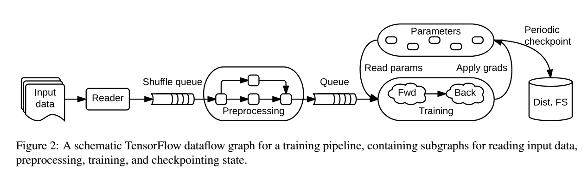
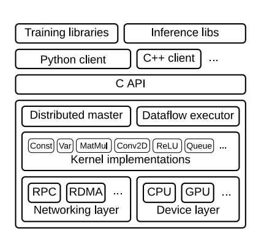

# TensorFlow：A System for Large-Scale Machine Learning
## 背景和动机
### 先前的系统：DistBelief
+ 使用Parameter Server架构，有局限性
  
  + 无状态的工作进程worker：执行训练模型时的计算

  + 有状态的参数服务进程parameter server：维护当前模型参数
  
+ 基于Python的接口不能满足高级需求。

+ 改进方向：
  
    + 定义新图层：用C++类，提高效率
  
    + 完善训练算法：某些接口并不完美适用于所有优化算法，将计算转移到参数服务器上可以减少网络流量

    + 定义新的训练算法：当前固定的执行模式只适用于简单的前馈神经网络，不适用于高级模型（递归神经网络、对抗网络、强化学习模型，还有其他不适用于神经网络训练模式的其他机器学习算法，如期望最大化ED，决策树，LDA）

+ 虽然DistBelief被设计为大型分布式多核服务器集群，并且支持GPU加速，但是它这种重量级系统更适合在大型数据集上进行训练，缩小放到其他环境中。
  
+ 有必要创造一个能够满足各个平台的不同性能和资源需求————TensorFlow为所有环境提供了一个单独的编程模型和运行时系统。

### 设计原则

TensorFlow比DistBelief更加灵活，它提供一种简单的基于数据流的编程抽象，允许用户在我们设计的在分布式集群，本地工作站，移动设备和定制设计的加速器上部署应用程序，使用户能够在不修改核心系统的情况下尝试不同的模型架构和优化算法。

+ 原始算符的数据流图：使用独立的数学操作符（如矩阵乘法、卷积）作为数据流图中的节点，便于用户使用高级脚本接口编写新的图层。优化算法要求每个层有定义的梯度，用简单操作符构建图层，便于区分不同模型。
  
+ 推迟执行：典型TensorFlow应用分为两阶段：第一阶段，用符号数据流图（包含用于输入数据的占位符核表示状态的变量）来定义程序；第二阶段，执行优化后的程序。等整个程序就绪后再执行，使得TensorFlow可以利用计算的全局信息来优化执行过程。
  
+ 异构加速器的通用抽象：为了适用于各种加速器，为设备定义通用抽象。设备需要实现：(i) 发布kernels用于执行，(ii) 为输入输出分配内存，(iii) 与主存之间传输缓冲区。每个操作符都有针对不同设备的实现，所以同样的程序可以轻松满足GPU、TPU和移动CPU的需求。

这些设计原则导致TensorFlow没有parameter server。我们在集群上将TensorFlow部署为一系列的任务tasks（可以网络通信的命名进程），它们可以导出相同的图执行API并包含一个或多个设备。这些任务中的一部分承担着parameter server的作用（称为PS tasks），剩下的是worker。不过PS task可以运行任何TensorFlow图，比传统parameter server更灵活，用户可以用定义模型的相同脚本接口来编程。与其他系统相比，灵活性是TensorFlow的最大特点。

## TensorFlow 执行模型

使用单一的数据流图表示机器学习算法中的所有计算和状态（包括独立的数学运算，参数及其更新规则）。数据流图清晰地表明了两个子运算之间的关系，因此可以轻松并行执行独立计算和跨多个设备分区的计算。
TensorFlow与批量数据流系统的区别：

+ 支持在整个图的重叠子图上进行多个并发执行。
  
+ 各个顶点可以具有可变状态，可以在图的不同执行之间共享。

在parameter server架构中，训练大型模型时可变状态是关键，因为它可以使大量参数的就地更新，并且尽快地将更新传播到同步训练步骤。具有可变状态的数据流使TensorFlow能够模拟parameter server的功能，但又具有灵活性，因为它可以在拥有共享模型参数的机器上执行任意数据流子图。 因此，用户能够尝试不同的优化算法，一致性方案和并行化策略。

### 数据流图的元素

在TensorFlow图中，每个顶点代表一个局部计算的单元，每条边代表一个顶点的输入或者输出。每个顶点的计算称为操作(operations)，沿着边流动的值称为张量(tensors)。下面介绍常见的操作类型和张量。

+ 张量
    
    用一些基本类型的元素（如int32，float32，string）将数据建模为张量。张量代表机器学习算法中数学运算的输入和输出，例如，矩阵乘法接收两个二维张量并生成一个二维张量，一个批量二维卷积需要两个四维张量并生成一个四维张量。
    
    所有张量都很密集，以便系统的底层可简单实现存储分配和串行化，减少框架开销。有两种表示稀疏数据的替代方案：一是将数据编码成密集张量的可变长度string；二是使用密集张量的元组（例如，具有m个非零元素的n维稀疏张量可以表示为m×n的坐标矩阵，和长度为m的向量）。 张量可以是一个或多个维度的，可以表示元素数量的不同的稀疏张量。

+ 操作
    
    一个操作将m>=0个张量作为输入，并输出n>=0个张量。操作具有命名的类型(如Const, MaMul, Assign)，并具有零或多个确定其行为的编译时属性（决定了输入和输出的预期类型和数量）。

    例如，最简单的操作Const没有输入只有单个输出，它的值是一个编译时属性；AddN对相同元素类型的多个张量求和，它具有定义其类型签名的类型属性T和整数属性N。

  + 有状态操作：变量variables

    操作可以包含每次执行时读取或写入的可变状态。Variable操作拥有可变缓冲区，该缓冲区可用于在训练模型时存储模型的共享参数。变量没有输入，会产生一个引用句柄，它有读取和写入缓冲区的功能。Read操作将引用句柄r作为输入，并将变量（State [r]）的值作为密集张量输出。其他操作修改底层缓冲区：例如，AssignAdd采用引用句柄r和张量值x，并且在执行时执行更新State'[r]←State [r] + x。后续的Read(r)操作产生值State'[r]。
    

  + 有状态操作：队列queues

    TensorFlow包含队列的几种实现，支持多种形式的协调。最简单的队列是FIFOQueue，内部包含与一个张量队列，支持以先进先出的顺序进行并发访问。 与变量类似，FIFOQueue操作生成一个引用句柄，以供标准队列操作使用，例如Enqueue和Dequeue。 这些操作将他们的输入推送到队列的尾部分别弹出head元素并输出。 如果给定队列已满，则Enqueue将阻塞，如果给定队列为空，则Dequeue将阻塞。 在输入预处理管道中使用队列时，此阻塞提供背压; 它还支持同步。 队列和动态控制流的组合也可以实现子图之间的流式计算形式。

    

### 局部和并发执行

执行图的API允许客户端声明式地指定应该执行的子图。客户端选择零或多个边将输入张量送到数据流，选择一或多个边从数据流中取出输出张量，运行时再精简图以包含必要的操作集。Tensorflow支持同一个图上的多个并发步骤（每次调用API称为一个步骤step），有状态操作允许步骤之间共享数据并在必要时进行同步。

下图显示了一个典型的训练应用程序，其中有多个子图并发执行并通过共享变量和队列进行交互。

  </img> 

局部和并发执行保证了TensorFlow的灵活性。

添加可变状态和通过队列协调可以在用户级代码中指定各种模型架构，高级用户无需修改TensorFlow运行时的内部结构即可进行实验。 默认情况下，TensorFlow子图的并发执行相对于彼此异步运行。 这种异步性可以更简单的实现那些具有弱一致性要求的机器学习算法，其中包括许多神经网络训练算法。TensorFlow还提供了在训练期间同步worker所需的原语，带来一些学习任务的有利结果。

### 分布式执行

通过明确子计算间的通信，数据流简化了分布式执行，使得同一个TensorFlow程序可以同时部署在用于训练的GPU集群，用于服务的TPU集群和用于移动推断的手机上。

每个操作分配在特定设备上，例如特定任务中的CPU或GPU。设备负责为分配给它的每个操作执行内核操作，.TensorFlow允许为单个操作申请多个内核，对特定设备或数据类型有专用的实现。可以使用不同编译器为CPU和GPU编译单个内核实现许多操作，例如元素操作符（Add，Sub等）。

TensorFlow运行时将操作放在设备上，受图中隐式或显式约束。 放置算法为每个操作计算一组可行的设备，，计算必须被共同放置的操作集合，并选择每个共置组都满意的设备。有状态操作和它们状态必须在同一个设备上，这导致了隐式的共置约束。 此外，用户可以指定部分设备偏好，例如“一个特定任务中的任何设备”或“任务中的任何一个GPU”，运行时将遵守这些约束。 一个典型的训练应用将使用客户端编程构造来添加约束，例如，参数分布于一组“PS”任务中。

因此，TensorFlow在如何将数据流图中的操作映射到设备上有巨大的灵活性。简单的启发式算法对新手来说性能足够了，专家用户可以通过人为放置操作来平衡多任务多设备间的计算、内存和网络需求。 ...

当放置好图中的操作且计算好一个步骤中局部子图后，TensorFlow将操作划分为每个设备的子图。 设备d的子图包含分配给d的所有操作，以及用于替换跨设备边界的边的附加Send和Recv操作。 只要张量可用，Send就会将其单个输入发送到指定的设备，使用集合键(rendezvous key)命名该值。 Recv有一个输出，并保持阻塞，直到指定的集合键的值在本地可用。 Send和Recv对几个设备类型对有不同实现。

我们优化了TensorFlow，低延迟地重复执行大型子图。 一旦步骤的图被修剪、放置和分区，其子图就会缓存在各自的设备中。 客户端会话维护了从步骤定义到高速缓存子图的映射，可以通过向每个参与任务发送一条小消息来启动大图上的分布式步骤。 该模型更适合静态的、可重用的图，但它也支持动态计算（利用动态控制流）。

### 动态控制流

TensorFlow支持包含条件和迭代控制流的高级机器学习算法。例如，诸如LSTM之类的递归神经网络（RNN）可以从序列数据生成预测。 谷歌的神经机器翻译系统使用TensorFlow训练深度LSTM，在许多翻译任务中实现最先进的性能。 RNN的核心是递归关系，其中序列元素i的输出是在序列上累积的某种状态的函数。 在这种情况下，动态控制流程可以对具有可变长度的序列进行迭代，而无需将计算展开到最长序列的长度。

TensorFlow使用通过数据流图推迟执行，将大量工作交付给加速器。为了实现RNN和其他高级算法，我们在数据流图里加上条件（if语句）和迭代（while循环）编程构造，用这些原语实现更高阶的构造，如map(),fold()和scan()。

处于以上目的，我们从经典动态数据流架构中借用Switch和Merge原语。

迭代的执行可以重叠，TensorFlow也可以跨多个设备和进程对条件分支和循环体进行分区。 分区步骤添加逻辑以协调每个设备上每次迭代的开始和终止，并确定循环的结束。TensorFlow还支持控制流构造的自动区分。 自动微分将计算梯度的子图添加到数据流图中，TensorFlow在有可能分布式计算的设备上进行分区，以并行计算梯度。

## 扩展案例研究

 ...
 
## 实现

  </img> 

+ Tensorflow runtime是一个跨平台库，C API将不同语言的用户级代码与核心运行机制分开。
+ 核心库以C ++实现，具有可移植性和以下性能：可在多个操作系统上运行，包括Linux，Mac OS X，Windows，Android和iOS; x86和各种基于ARM的CPU架构;和NVIDIA的Kepler，Maxwell和Pascal GPU微体系结构。实现是开源的。
+ Distributed master将用户请求转换为跨任务的执行。给定计算图和步骤，对图进行修剪(prune)和分区(partition)，以获得每个参与设备的子图，并缓存这些子图，以便在后续步骤中重复使用。由于master能看见步骤的全部计算，它应用标准优化（例如公共子表达式消除和常量折叠;修剪是一种消除dead代码的形式），然后协调一组任务中优化子图的执行。
+ Dataflow executer处理来自master的请求，并调度包含本地子图的kernel的执行。我们优化Dataflow execute，以便低开销地运行大型图。当前每秒执行10,000个子图，这使得大量复制副本可以进行快速，细粒度的训练步骤。Dataflow executer将内核分派给本地设备，并且在可能时并行运行内核。
+ runtime包含超过200个标准操作，包括数学，数组操作，控制流和状态管理操作。许多操作kernel使用Eigen::Tensor，它使用C++模板为多核CPU和GPU生成高效的并行代码；也使用像cuDNN这样的库来实现更高效的kernel。 还实现了对量化的支持，能加速诸如移动设备和高吞吐量数据中心应用中的推断（inference），使用gemmlowp低精度矩阵乘法库加速量化计算。
+ 为每对源和目标设备类型设计专门的Send和Recv操作。本地CPU和GPU设备之间的传输使用cudaMemcpyAsync()API，用来重叠计算和数据传输； 两个本地GPU之间的传输使用DMA，以缓解主机上的压力。 对于任务之间的传输，TensorFlow支持多种协议，包括基于TCP的gRPC、基于聚合以太网的RDMA。对GPU到GPU通信的优化还在考察中。
+ 在用户级代码中，完全用C语言API实现了功能。 通常，用户通过组建标准操作来构建更高级的抽象，例如神经网络层，优化算法和分片嵌入计算。TensorFlow支持多种客户端语言，优先支持Python和C++，用户最熟悉这些语言。随着功能的成熟，通常将它们移植到C++，以便用户可以从所有客户端语言访问优化后的实现。
+ 如果将子计算表示为操作的组合有困难或者低效，用户可以注册用C++编写的提供有效实现的额外kernel。 对于某些性能要求苛刻的算子，例如ReLU和Sigmoid激活函数及对应的梯度，手动实现内核融合比较好。目前正在研究使用Halide和其他基于编译器的技术实现内核自动融合。 
+ 除了core runtime，也有一些辅助用户的工具，包括在生产中用于推断的服务基础设施：可视化仪表板dashboard—使用户能够跟踪训练运行的进度，图形可视化器—帮助用户理解模型中的连接，分布式分析器—跟踪跨越多个设备和任务的计算的执行。 